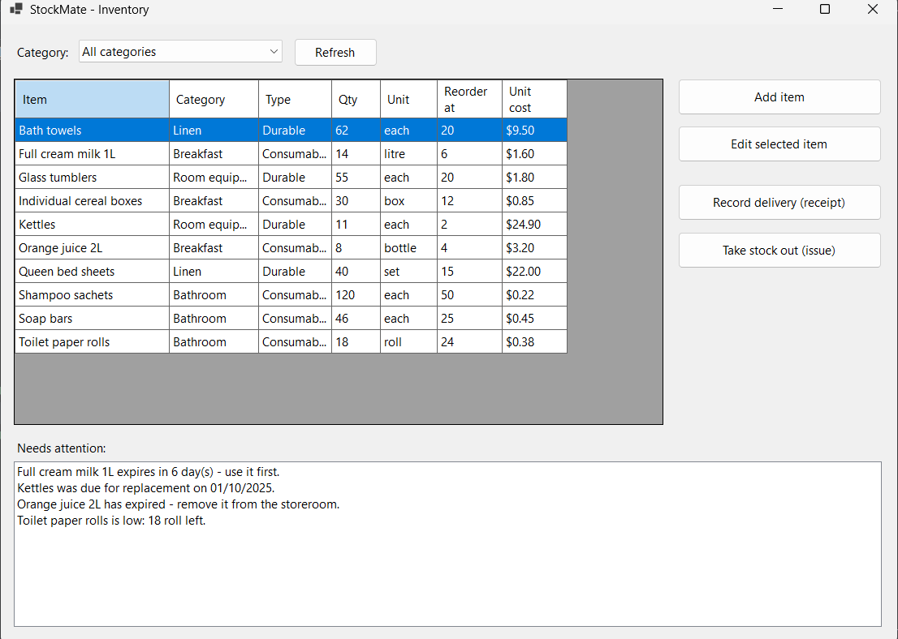
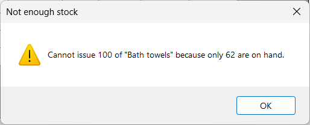

# StockMate

A simple stock tracker for a small motel, written in C# and Windows Forms for
**ITS203 Object-Oriented Design and Programming**, Assessment C.

**Author:** Aashir Bhusal (s2400901)

## What it does

Small motels go through towels, sheets, soap and breakfast items every day, and most track
it on a piece of paper or not at all. So they run out of things mid-shift, or over-order
and throw stock away when it goes out of date.

StockMate keeps a count of every item at one motel. Staff record a **receipt** when a
delivery arrives and an **issue** when stock is taken out, and each one saves the date and
the staff member's name. When the program opens it warns about items that are running low
and consumables that are about to expire.

## Screenshots

The main window, with the stock list, the category filter and the warnings shown on start-up:



Trying to take out more stock than there is:



## What you need

- Windows 10 or 11
- The [.NET 8 SDK](https://dotnet.microsoft.com/download/dotnet/8.0), or Visual Studio 2022
  with the ".NET desktop development" workload

## How to run it

```
git clone https://github.com/AashirBhusal/StockMate.git
cd StockMate
dotnet run --project StockMate
```

Or open `StockMate.sln` in Visual Studio 2022 and press **F5**.

The database file `stockmate.db` is created automatically the first time you run it. It is
not stored in Git, so each copy starts empty.

## Folders

```
StockMate/
├── Models/     The classes and the rules
├── Data/       Saving and loading from SQLite
└── Forms/      The windows the user sees
```

## OOP principles used

| Principle | Where |
|---|---|
| Classes and objects | `StockItem`, `ConsumableItem`, `DurableItem` |
| Encapsulation | `QuantityOnHand` has a private setter, so it can only change through `Receive()` and `Issue()` |
| Inheritance | `ConsumableItem` and `DurableItem` both extend `StockItem` |
| Polymorphism | `NeedsAttention()` is overridden, so each type decides for itself |
| Abstraction | `StockItem` is abstract; `IReportable` is an interface |
| Exception handling | `InsufficientStockException` is thrown by `Issue()` and caught by the form |

## Progress

- [x] Milestone 1 proposal
- [x] Project set up
- [x] Models: `StockItem`, `ConsumableItem`, `DurableItem`, `IReportable`, `InsufficientStockException`
- [x] Database and saving; add and edit items (FR-01, editing half of FR-02)
- [x] Main window with the item list and category filter (FR-05)
- [x] Receipt and issue screens (FR-03, FR-04)
- [x] Low stock and expiry warnings (FR-06)
- [x] Milestone 2 progress report
- [ ] Deactivate button so a retired item keeps its history (rest of FR-02)
- [ ] History screen (FR-07)
- [ ] CSV export (FR-08)

## References and Tools Used

- Microsoft, *Desktop Guide (Windows Forms .NET)* — https://learn.microsoft.com/en-us/dotnet/desktop/winforms/
- Microsoft, *Microsoft.Data.Sqlite overview* — https://learn.microsoft.com/en-us/dotnet/standard/data/sqlite/
- SQLite, *Appropriate uses for SQLite* — https://www.sqlite.org/whentouse.html
- Troelsen, A. & Japikse, P. (2022). *Pro C# 10 with .NET 6* (11th ed.). Apress.

**Generative AI disclosure.** I used Claude (Anthropic) as study support on this project:
to talk through the class design, to help write and comment the `Models` classes, and to
check my code for mistakes. I have read and understood all of it and can explain every
part. The same disclosure appears in my Milestone 3 reflection.

> Keep this section up to date. ITS203 requires GenAI help to be declared here and in the
> Milestone 3 reflection. Declared help is allowed; undeclared help is misconduct.
