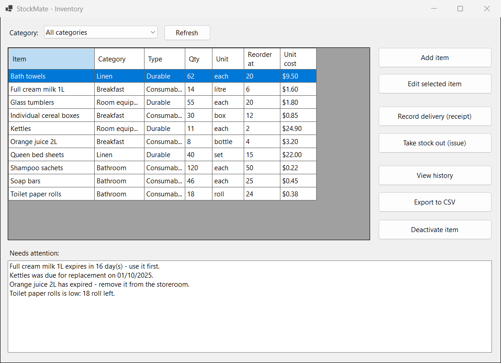
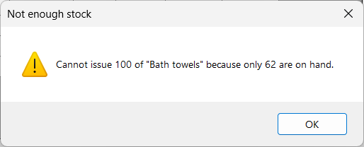
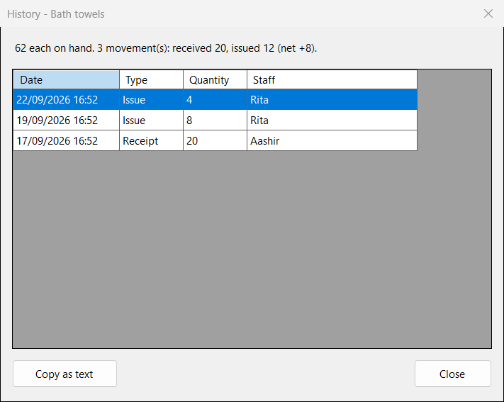
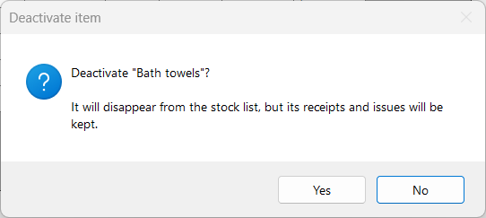

# StockMate

A simple stock tracker for a small motel, written in C# and Windows Forms for
**ITS203 Object-Oriented Design and Programming**, Assessment C.

**Author:** Aashir Bhusal (s2400901)

## What it does

Small motels go through towels, sheets, soap and breakfast items every day, and most track
it on a piece of paper or not at all. So they run out of things mid-shift, or over-order
and throw stock away when it goes out of date.

StockMate keeps a count of every item at one motel:

- **Add and edit items.** A *consumable* (milk, soap) has a use-by date. A *durable* (towels,
  kettles) has a replacement interval instead.
- **Record receipts and issues.** A receipt adds to the count when a delivery arrives, an issue
  takes away when stock leaves the storeroom. Each one saves the date and the staff member's
  name. An issue for more than is on hand is refused, with the reason.
- **Warnings when it opens.** Items at or below their reorder level, consumables that expire
  within 30 days or have expired, and durables that are due for replacement.
- **Filter by category.**
- **History.** Every receipt and issue for one item, newest first, which can be copied as text.
- **Export to CSV.** The list on screen, with the total stock value, in a file Excel can open.
- **Deactivate.** Take an item off the list without losing its history.

## Screenshots

The main window, with the stock list, the category filter and the warnings shown on start-up:



Trying to take out more stock than there is:



The history of one item, newest first:



Deactivating an item asks first:



## What you need

- Windows 10 or 11
- The [.NET 8 SDK](https://dotnet.microsoft.com/download/dotnet/8.0), or Visual Studio 2022
  with the ".NET desktop development" workload

## How to run it

```
git clone https://github.com/AashirBhusal/StockMate.git
cd StockMate
dotnet run --project StockMate
```

Or open `StockMate.sln` in Visual Studio 2022 and press **F5**.

The database file `stockmate.db` is created automatically the first time the program runs. It
is kept next to the program itself (`StockMate/bin/Debug/net8.0-windows/`), so the same data is
found however the program is started. It is not stored in Git, so each copy starts empty.

If .NET was installed for one user only (without administrator rights), `StockMate.exe` will
not start by double-click until `DOTNET_ROOT` points at that install. In PowerShell:

```
$env:DOTNET_ROOT = "$HOME\.dotnet"
```

## Folders

```
StockMate/
├── Models/     The classes and the rules
├── Data/       Saving and loading from SQLite, and the CSV export
└── Forms/      The windows the user sees
docs/
├── TESTING.md  The test scenarios and what they found
└── screenshots/
```

No form contains SQL, and no form can change a quantity directly.

## OOP principles used

| Principle | Where |
|---|---|
| Classes and objects | `StockItem`, `ConsumableItem`, `DurableItem`, `StockMovement`, `Database`, `CsvExporter`. Each database row becomes one object. |
| Encapsulation | `QuantityOnHand` has a private setter, so it can only change through `Receive()` and `Issue()`, which check the rules first. Name, category, reorder level and unit cost are validated in their setters. |
| Inheritance | `ConsumableItem` and `DurableItem` both extend `StockItem` and add only what is different about them. |
| Polymorphism | `NeedsAttention()`, `AttentionMessage()` and `ToReportLine()` are overridden. `MainForm.ShowWarnings()` and `CsvExporter.Export()` call them on a `List<StockItem>` without checking the type. `HistoryForm` puts an item and its movements in one `List<IReportable>`. |
| Abstraction | `StockItem` is abstract, because a plain stock item cannot say whether it needs attention. `IReportable` is an interface implemented by both `StockItem` and `StockMovement`, which are otherwise unrelated. |
| Exception handling | `InsufficientStockException` is thrown by `Issue()` and caught in its own `catch` block before the general one. Invalid values throw `ArgumentException` from the setters and are shown as a message. The export catches `IOException` for a file that is open elsewhere. |

## Requirements from the proposal

| ID | Requirement | Status |
|---|---|---|
| FR-01 | Add a consumable or durable item | Done |
| FR-02 | Edit an item, or turn it off without losing its history | Done |
| FR-03 | Record a delivery (receipt) | Done |
| FR-04 | Record an issue; refuse to take out more than there is | Done |
| FR-05 | Item table with a category filter | Done |
| FR-06 | Warning list when the program opens | Done |
| FR-07 | History for one item | Done |
| FR-08 | Export the stock list, with a total value, to CSV | Done |

## Testing

38 scenarios were run through the real windows against a separate test database on 4 October
2026. 36 passed first time; 2 failed, were fixed and passed when re-run. The full list, the
problems found and the limits that remain are in [docs/TESTING.md](docs/TESTING.md).

## Milestone documents

- [Milestone 1 proposal](ITS203_M1_Proposal_Aashir_Bhusal_s2400901.pdf)
- [Milestone 2 progress report](ITS203_M2_ProgressReport_Aashir_Bhusal_s2400901.pdf)
- [Milestone 3 reflection](ITS203_M3_Reflection_Aashir_Bhusal_s2400901.pdf)
- [Development notes](NOTES.md)

## References and Tools Used

- Microsoft, *Desktop Guide (Windows Forms .NET)* — https://learn.microsoft.com/en-us/dotnet/desktop/winforms/
- Microsoft, *Microsoft.Data.Sqlite overview* — https://learn.microsoft.com/en-us/dotnet/standard/data/sqlite/
- SQLite, *Appropriate uses for SQLite* — https://www.sqlite.org/whentouse.html
- Troelsen, A. & Japikse, P. (2022). *Pro C# 10 with .NET 6* (11th ed.). Apress.

Tools: .NET 8 SDK, Windows Forms, Microsoft.Data.Sqlite 8.0.8, Visual Studio Code, Git and GitHub.

**Generative AI disclosure.** I used Claude (Anthropic) as study support on this project:
to talk through the class design, to help write and comment the `Models` classes, and to
check my code for mistakes. I have read and understood all of it and can explain every
part. The same disclosure appears in my Milestone 3 reflection.
